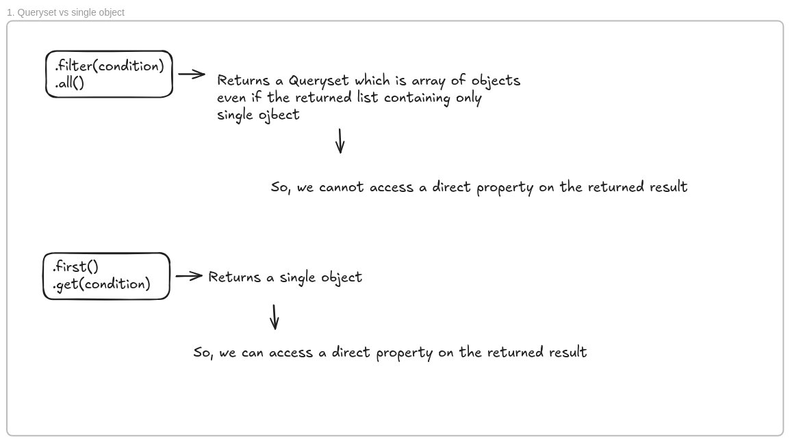

# django-orm-series
learning django orm from this course : `https://www.youtube.com/playlist?list=PL-2EBeDYMIbQXKsyNweppuFptuogJe2L-`

# Notes On Modeling Data From Django To Actual DB:
1. Naming the FK fields as `[resource]` will reflect on the database as `[resource]_id`.
2. Not Specifying the `id` field and let django define it will mark it as `serialize=False` and won't be serialzied to json.


# RunScript utility in Django: 
- we can use a utility called `runscript` to run direct scripts inside our app 
```shell
└─▪ cd [your_app]
└─▪ mkdir scripts
└─▪ touch __init__.py
└─▪ touch [script_name].py
└─▪ python3 manage.py 
```
- now define a `run()` function and to run the script
```shell
└─▪ python3 manage.py runscript [script_name] # without .py
```

# Notes about Queries in Django
1. Django queries are lazely executed:

```python
def select_first_resurant() -> Resturant:
    first_resurant = Resturant.objects.first() # so far the SELECT statment query is not executed yet 
    return first_resurant # once we use the fetched data .. the query will be executed 
```


2. Queryset .vs. Single object ? 
```python
def get_resturant_name_by_rating_id(rating_id):
    rating = Rating.objects.filter(id=rating_id)
    resturant = rating.resturant  # NOT VALID and NOT COMPILED
    rating = Rating.objects.first()
    resturant = rating.resturant  # VALID and COMPILED
    return resturant.name
```


- solution 
```python
def get_resturant_name_by_rating_id(rating_id):
    rating = Rating.objects.get(id=rating_id)
    resturant = rating.resturant  # NOT VALID and NOT COMPILED
    return resturant.name
```